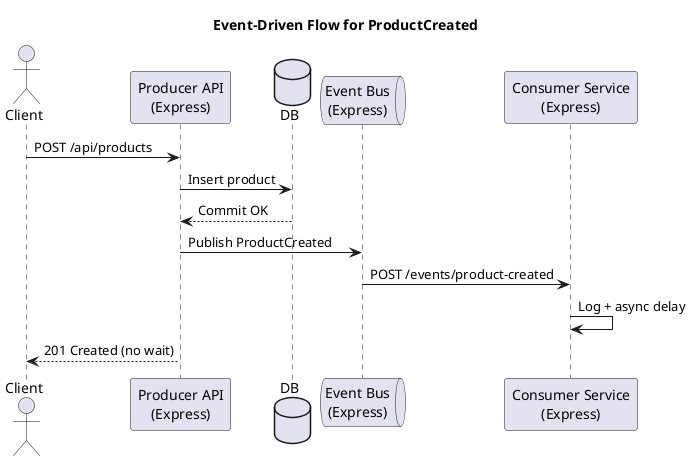

# Event Driven Architecture Extension (Lab Deliverables)

## Domain Event
**Event:** `ProductCreated` (emitted after a product is inserted into the database via `POST /api/products`).

## Architecture Diagram (ASCII)
```
Client
  |
  | 1) POST /api/products
  v
Producer API (Express)
  | 2) DB commit
  | 3) Publish ProductCreated
  v
Event Bus (Express + in-memory subscriptions)
  | 4) Push to subscribers
  v
Consumer Service (Express)
  | 5) Side effect (logging)
```

## Architecture Diagram (PlantUML)


## Example Logs (Asynchronous Behavior)
```
# API (producer)
Server running on http://localhost:3000
[EventPublisher] Published ProductCreated for entity 42

# Event Bus
Event bus listening on http://localhost:4001
[EventBus] Registered subscription 6d1b... for ProductCreated -> http://localhost:4002/events/product-created
[EventBus] Received ProductCreated for entity 42
[EventBus] Delivered ProductCreated to http://localhost:4002/events/product-created

# Consumer
Product consumer listening on http://localhost:4002
[Consumer] Received ProductCreated for entity 42 at 2025-01-01T12:00:00.000Z
[Consumer] Finished processing ProductCreated for entity 42 at 2025-01-01T12:00:02.000Z
```
The API response is returned immediately after the DB commit and does **not** wait for the consumer’s delayed processing logs.

## Verification Notes
- Stopping the consumer service does not affect API responses; the producer still commits to the DB and publishes events.
- The event bus logs delivery failures if a consumer is unavailable, without blocking the API.

## 150–200 Word Technical Explanation
The chosen domain event is **ProductCreated**, emitted every time a product is successfully inserted through the existing `POST /api/products` operation. After the database commit completes, the producer API publishes a domain event containing `eventName`, `entityId`, `timestamp`, and metadata (price, quantity, user, and source). A lightweight Event Bus process receives the event and forwards it to registered subscribers, while the API responds immediately to the client without waiting for downstream consumers. The consumer service runs as a separate process and subscribes to `ProductCreated` events. It performs a non-blocking side effect (logging with a simulated delay) to demonstrate asynchronous processing. This design keeps the system loosely coupled: the producer does not know the consumer implementation, and consumer downtime does not impact the API. Event Driven Architecture improves scalability and resilience by decoupling services, enabling independent evolution of producer and consumer services, and allowing additional consumers (analytics, notifications) to be added without modifying the core API.

## Final Submission Checklist
- Full source code for both the **producer** and **consumer** services (this repo includes both).
- Evidence of functionality that shows the **asynchronous** event flow:
  - Screenshots of terminal logs **or** copied log output showing the producer publishing, the event bus delivering, and the consumer processing.
  - Use the **Example Logs** section above as the expected format.
- A clear **architecture diagram** (paste the PlantUML code above into PlantUML and export the image).
- A **150–200 word written explanation** describing the event, producer/consumer roles, and the benefits of using EDA (see the explanation section above).